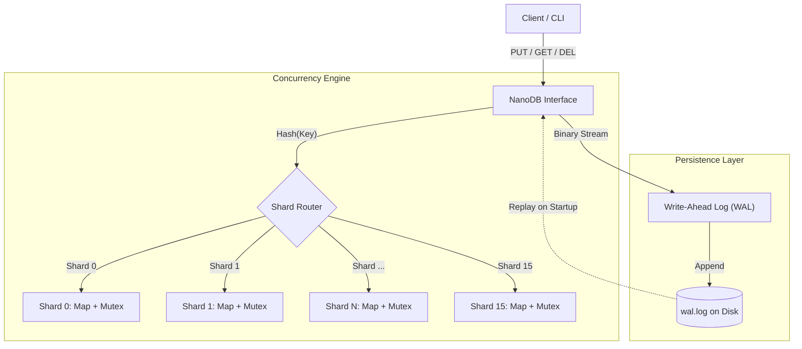

# NanoDB: High-Performance Log-Structured Key-Value Store


## 📖 Overview

**NanoDB** is a multi-threaded, persistent, embedded key-value storage engine engineered from scratch in **C++17**. It is designed to demonstrate core principles of **distributed file systems** and **high-concurrency systems programming**.

Unlike standard in-memory maps, NanoDB implements a **Write-Ahead Log (WAL)** for durability (crash recovery) and uses **Sharded Locking** to minimize thread contention during high-throughput workloads. It supports full persistence, allowing data to survive process crashes and power failures, mirroring the architecture of modern distributed storage systems like **Cassandra** or **RocksDB**.

## 🚀 Key Features

* **⚡ Granular Concurrency:** Implements **Sharded Locking** (Partitioning) to reduce critical section bottlenecks. Instead of a single global lock, the key space is hashed into multiple shards, allowing concurrent writes to different segments of the database.
* **🛡️ ACID-Compliant Durability:** Features a custom **Write-Ahead Log (WAL)**. Every mutation (PUT/DEL) is serialized and appended to disk before being applied to memory, ensuring **Crash Consistency**.
* **🧠 Reader-Writer Optimization:** Utilizes `std::shared_mutex` to allow **lock-free reads** for multiple simultaneous readers while ensuring exclusive access for writers.
* **⚰️ Tombstone Deletion:** Implements Log-Structured deletion logic using **Tombstone markers**, avoiding expensive in-place file modification and mimicking the behavior of LSM-Trees.
* **🐍 Automated Integration Testing:** Includes a Python-based **Blackbox Testing Suite** that spawns the C++ daemon, simulates client usage, and validates data integrity and persistence.

---

## 🏗️ Architecture

NanoDB uses a **Hash-Partitioned Architecture** coupled with an append-only persistence layer.

### System Diagram



## Technical Implementation Details
### 1. Sharding & Hashing:

* Keys are hashed using std::hash and mapped to one of N shards (default 16).
* Impact: Reduces lock contention by a factor of N. If Thread A writes to Shard 0, Thread B can simultaneously write to Shard 1 without blocking.

### 2. Write-Ahead Logging (WAL):

* Format: [KeySize: 8B][Key: NB][ValueSize: 8B][Value: NB]
* Binary serialization ensures efficient disk usage and robust parsing.
* Recovery: On startup, the system reads the binary log sequentially to reconstruct the in-memory hash maps.

### 3. Tombstones:

* Deletions are recorded as a special sentinel value (||__TOMBSTONE__||) in the log.
* During recovery, this sentinel triggers a removal event in the in-memory index.

## 🛠️ Build & Run
### Prerequisites
* **OS**: Linux (Ubuntu/Debian recommended)
* **Compiler**: GCC 7+ (Requires C++17 support)
* **Dependencies**: build-essential

**Installation**
```bash

# Clone the repository
git clone https://github.com/Shorya-agarwal/NanoDB.git
cd NanoDB/src

# Compile with threading support and C++17 optimization
g++ -std=c++17 -pthread main.cpp -o nanodb
```
**Usage**
Run the interactive CLI:
```bash
./nanodb
```
**Commands:**
* PUT <key> <value> : Insert or update a record.
* GET <key> : Retrieve a record.
* DEL <key> : Remove a record (soft delete via tombstone).
* EXIT : Safely shutdown the engine.

**Example Session**:
```Plaintext
nanodb> PUT user_123 {"name": "Alice", "role": "admin"}
OK
nanodb> GET user_123
{"name": "Alice", "role": "admin"}
nanodb> DEL user_123
OK (Deleted)
nanodb> EXIT
```
## 🧪 Testing
NanoDB includes a Python integration test suite to verify correctness and persistence.

**Run the Stress Test:**
```bash
cd tests
python3 integration_test.py
```

**Expected Output:**
```Plaintext
--- Testing Basic PUT/GET/DEL ---
PUT user1 -> OK
GET user1 -> Alice
DEL user1 -> OK (Deleted)
...
ALL SYSTEMS GO: NanoDB is ready for production.
```
## 🔮 Future Roadmap
* SSTable Compaction: Implement background log compaction to merge old logs and remove tombstoned records to save disk space.
* TCP Interface: Replace CLI with a socket server (handling connect, send, recv) to allow remote connections.
* Bloom Filters: Add probabilistic data structures to quickly check if a key exists before searching shards (reducing latency).

# 👨‍💻 Author
Shorya Agarwal | Systems Engineer & C++ Developer | MS CE @TAMU  | [](https://www.linkedin.com/in/shoryaag/)
