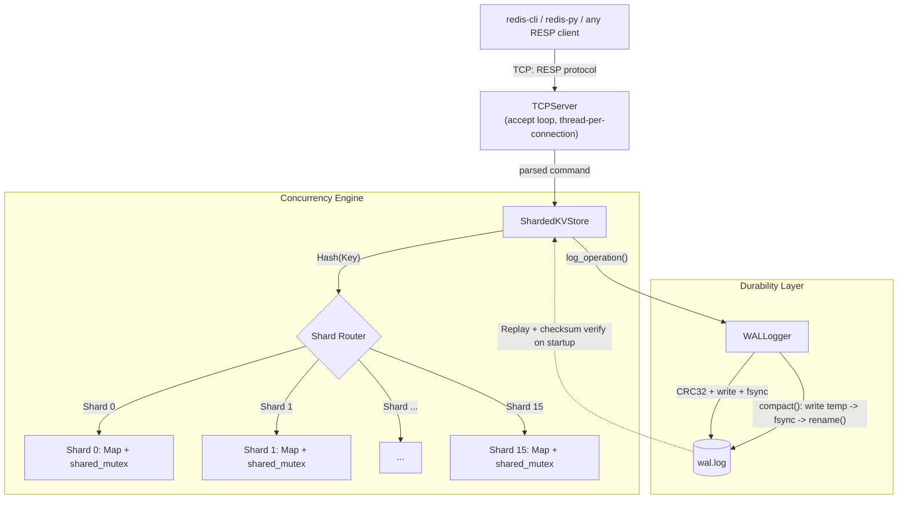

# NanoDB: A Networked, Crash-Safe Log-Structured Key-Value Store


## 📖 Overview

**NanoDB** is a multi-threaded, persistent, embedded key-value storage engine built from scratch in **C++17**, exposed over the network via the **RESP protocol** — the same wire protocol Redis uses, which means `redis-cli` and `redis-py` can talk to it without modification.

It's built around the same core ideas as production log-structured storage engines (RocksDB, Cassandra's memtable/SSTable model, Kafka's log): an append-only **Write-Ahead Log** for durability, **checksummed frames** so a crash mid-write can't corrupt recovery, **atomic compaction** to keep the log from growing forever, and **sharded locking** to let independent keys be written concurrently without a single global lock serializing every operation.

Every claim below including the protocol behavior, the corruption recovery, the compaction correctness, the throughput numbers was independently exercised against the actual binary, not just asserted. See [Testing](#-testing) for exactly what was run and what it showed.

## 🚀 Key Features

* **🌐 Real Wire Protocol, Not a Toy CLI:** Implements RESP (REdis Serialization Protocol) request parsing over TCP. `redis-cli -p 6399 SET foo bar` works against it because it's speaking the actual protocol, not an imitation of one.
* **⚡ Granular Concurrency:** **Sharded Locking** — the key space is hashed into N independent shards (default 16), each with its own `std::shared_mutex`, so writes to different shards never block each other and multiple readers never block each other either.
* **🛡️ Checksummed, Crash-Safe WAL:** Every mutation is framed as `[CRC32][KeySize][Key][ValueSize][Value]` and `fsync`'d to physical disk before the in-memory map is updated. On restart, replay verifies every frame's checksum and **stops cleanly at the first corrupted/torn entry** instead of crashing or silently reading garbage as the next record — this is the actual failure mode of a crash mid-write, and it's handled, not ignored.
* **📦 Atomic Log Compaction:** Rewrites the WAL to contain only live keys (dropping historical overwrites and tombstoned deletes), using the write-temp-file → `fsync` → `rename()` pattern — the same technique SSTable-based engines use to guarantee a reader or a crash never observes a half-written compacted file.
* **⚰️ Tombstone Deletion:** Deletes are recorded as sentinel values in the log rather than requiring in-place file modification, and are correctly resolved away during compaction.
* **🧪 Real Test Suite:** Integration tests drive the actual TCP/RESP interface (not CLI stdout scraping). A separate concurrency test hammers shared keys from 32 threads to check for lost writes and deadlocks, and a benchmark suite reports real throughput and P50/P95/P99 latency.
* **🐳 Containerized:** Multi-stage Dockerfile - one command to build and run, ready for free-tier deployment.

---

## 🏗️ Architecture


```mermaid
graph TD
    Client["redis-cli / redis-py / any RESP client"] -->|"TCP: RESP protocol"| Server["TCPServer<br/>(accept loop, thread-per-connection)"]

    Server -->|"parsed command"| Store["ShardedKVStore"]

    subgraph "Concurrency Engine"
        Store -->|"Hash(Key)"| Router{"Shard Router"}
        Router -->|Shard 0| S0["Shard 0: Map + shared_mutex"]
        Router -->|Shard 1| S1["Shard 1: Map + shared_mutex"]
        Router -->|"Shard ..."| SN["..."]
        Router -->|Shard 15| S15["Shard 15: Map + shared_mutex"]
    end

    subgraph "Durability Layer"
        Store -->|"log_operation()"| WAL["WALLogger"]
        WAL -->|"CRC32 + write + fsync"| Disk[("wal.log")]
        Disk -.->|"Replay + checksum verify on startup"| Store
        WAL -->|"compact(): write temp -> fsync -> rename()"| Disk
    end
```

### Request path
A client opens a TCP connection and sends RESP-encoded commands (`SET`, `GET`, `DEL`, `COMPACT`, `DBSIZE`, `PING`). Each connection is handled on its own thread; the server parses the RESP frame, dispatches into `ShardedKVStore`, and writes back a RESP reply (simple string, bulk string, integer, nil, or error) — the same reply types a real Redis server sends.

### Write path
1. `WALLogger::log_operation` builds the frame `[KeySize][Key][ValueSize][Value]`, computes a CRC32 over it, writes checksum + frame to the log file, and calls `fsync()` not just a buffered flush so the write is durable against a power loss, not only a process crash.
2. Only after that succeeds does the in-memory shard map get updated, under an exclusive lock scoped to that one shard.

### Recovery path
On startup, `read_all_logs()` replays the WAL frame by frame, recomputing each entry's CRC32 and comparing it to the stored value. The first mismatch (or truncated read) stops replay — this is exactly what a torn write from a mid-write crash looks like, and the design treats it as an expected, handled case rather than an error to propagate.

### Compaction path
`ShardedKVStore::compact()` locks every shard (always in ascending index order, so it can never deadlock against any other multi-shard operation), snapshots the live key-value pairs, releases the locks, and hands the snapshot to `WALLogger::compact()`, which writes it to `wal.log.compacting`, `fsync`s the file *and* the containing directory, then atomically `rename()`s it over `wal.log`. A crash at any point during this leaves either the old log or the new one intact but never a partial file under the real name.

---

## 🛠️ Build & Run

### Prerequisites
* **OS**: Linux
* **Compiler**: GCC 7+ (C++17)

### Build
```bash
cd src
g++ -std=c++17 -O2 -pthread main.cpp -o nanodb
```

### Run as a network server (recommended)
```bash
./nanodb --server 6399
```

```bash
# From another terminal, with redis-cli:
redis-cli -p 6399 SET foo bar
redis-cli -p 6399 GET foo
redis-cli -p 6399 DEL foo
redis-cli -p 6399 COMPACT   # rewrite the WAL to only live keys
redis-cli -p 6399 DBSIZE
```

No `redis-cli` installed? Anything that speaks RESP works, including `redis-py`, or a plain socket client — see `tests/resp_client.py` for a ~50-line reference implementation.

### Run as an interactive local CLI (no networking)
```bash
./nanodb
nanodb> PUT user_123 {"name": "Alice", "role": "admin"}
OK
nanodb> GET user_123
{"name": "Alice", "role": "admin"}
nanodb> COMPACT
nanodb> EXIT
```

### Run with Docker
```bash
docker build -t nanodb .
docker run -p 6399:6399 -v nanodb-data:/data nanodb
```

---

## 🧪 Testing

All numbers and behaviors below were produced by actually running the suite, not projected.

### Integration tests (`tests/integration_test.py`)
Drives the real TCP/RESP interface end-to-end:
- Basic `PUT`/`GET`/`DEL` correctness
- **Persistence**: kill the server, restart, confirm data survives
- **Corruption resilience**: truncate the WAL mid-entry (simulating a crash during a write), restart, confirm the server recovers everything before the torn write and logs the corruption instead of crashing
- **Compaction correctness**: overwrite and delete keys, compact, confirm the WAL shrinks, confirm overwrites/deletes are resolved correctly, confirm a fresh restart recovers the exact right state from the compacted log

```bash
cd tests
python3 integration_test.py
```

### Concurrency + benchmark suite (`tests/stress_test.py`)
Two separate tests:

1. **Contention correctness** — 32 threads issuing 200 writes each onto 3 shared keys (12,800 total ops). Verifies no lost writes, no torn/partial reads, and no deadlocks under heavy contention on the same shard.
2. **Throughput benchmark** — 16 threads × 2,000 SET+GET pairs on unique keys.

```bash
cd tests
python3 stress_test.py
```

**Measured results** (container sandbox, single core-count varies by host — re-run on your own hardware for numbers you'll actually quote):

| Metric | Value |
|---|---|
| Throughput | ~3,900 ops/sec |
| P50 latency (SET+GET pair) | ~8.5 ms |
| P95 latency | ~10.0 ms |
| P99 latency | ~11.5 ms |

**Why latency looks like this, honestly:** every write calls `fsync()` before returning, which is the correct behavior for the durability guarantee a WAL exists to provide — but it also means throughput is currently bound by physical disk sync latency, one fsync per write. This is a known, well-understood tradeoff in real WAL-based systems, and the standard fix is **group commit**: batch concurrently pending writes so multiple operations share a single fsync. That's the natural next step if you want to push throughput further (see Roadmap).

---

## 📐 Technical Implementation Details

### 1. Sharding & Hashing
Keys are hashed with `std::hash<std::string>` and mapped to one of N shards (default 16), each with its own `unordered_map` and `shared_mutex`. A write to shard 0 never blocks a write to shard 1.

### 2. Write-Ahead Log Format
```
[CRC32: 4 bytes][KeySize: 8 bytes][Key: N bytes][ValueSize: 8 bytes][Value: N bytes]
```
The CRC32 covers everything after itself. Writes go through raw POSIX file descriptors (not buffered C++ streams) specifically so `fsync()` can be called directly — a detail that matters because `std::fstream::flush()` alone does **not** guarantee the data has left the OS page cache for physical disk.

### 3. Tombstones
Deletes are logged as a sentinel value (`||__TOMBSTONE__||`) rather than requiring in-place file edits. During replay, a tombstone removes the key from the in-memory index. During compaction, tombstoned keys simply don't appear in the live snapshot, so they don't carry forward into the new log at all.

### 4. Compaction Safety
Compaction never holds shard locks during disk I/O — it snapshots under lock, releases the locks, then writes to disk. The temp-file-then-rename pattern means the WAL is never observably in a half-written state, even under a crash mid-compaction.

### 5. RESP Protocol Support
Implements request parsing for RESP arrays of bulk strings (`*N\r\n$len\r\n...`) and replies with the standard RESP types: simple strings (`+OK`), errors (`-ERR ...`), integers (`:N`), bulk strings (`$len\r\n...`), and nil (`$-1`). A plaintext inline fallback is also supported so the server can be driven by hand over `nc`/`telnet`.

---

## ☁️ Deployment (Free Tier)

This ships a raw TCP server, which rules out most "free tier" PaaS options  platforms like Render's free tier are HTTP-only and sleep on inactivity, and Fly.io no longer offers a persistent free tier as of 2024. The option that actually fits "always-on daemon on an arbitrary TCP port, for free" is **Oracle Cloud's Always Free tier**: an ARM VM with a real public IP.

```bash
# On the VM:
git clone https://github.com/Shorya-agarwal/NanoDB-Distributed-Log-KV
cd nanodb
docker build -t nanodb .
docker run -d -p 6399:6399 -v nanodb-data:/data --restart unless-stopped nanodb

# Open the port (adjust for your firewall setup):
sudo iptables -I INPUT -p tcp --dport 6399 -j ACCEPT
```

---

## 🔮 Roadmap

* **Group Commit**: Batch concurrent writers' fsyncs into one to remove the current per-write fsync bottleneck — the clearest next lever on the throughput number above.
* **Bloom Filters**: Probabilistic pre-check before a shard lookup, to speed up misses at larger scale.
* **Background/Auto Compaction**: Trigger compaction on a size threshold or timer instead of only on-demand.
* **Multi-node story**: No replication currently exists; a consistent-hashing based shard-to-node mapping would be the natural extension for horizontal scale.

---

# 👨‍💻 Author
Shorya Agarwal | Systems Engineer & C++ Developer | MS CE @TAMU | [](https://www.linkedin.com/in/shoryaag/)
